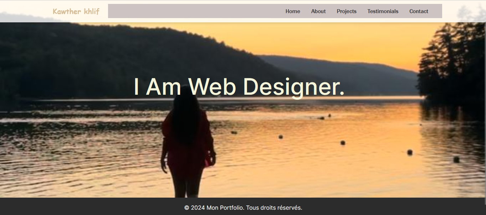
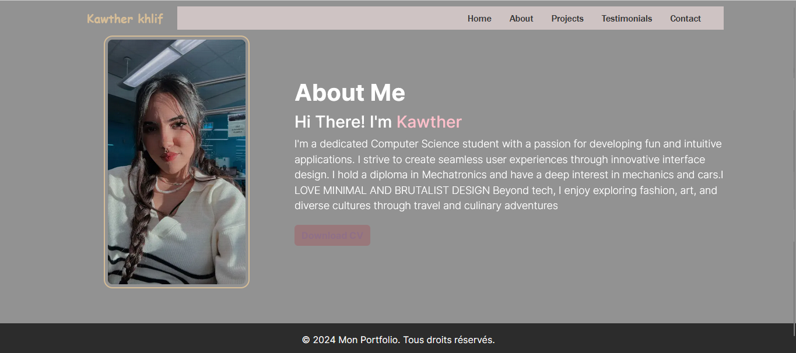
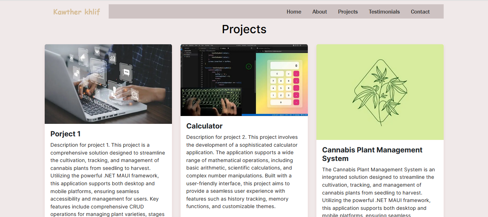
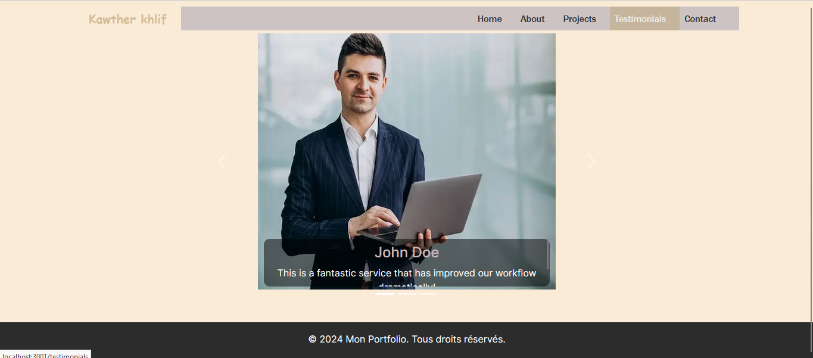
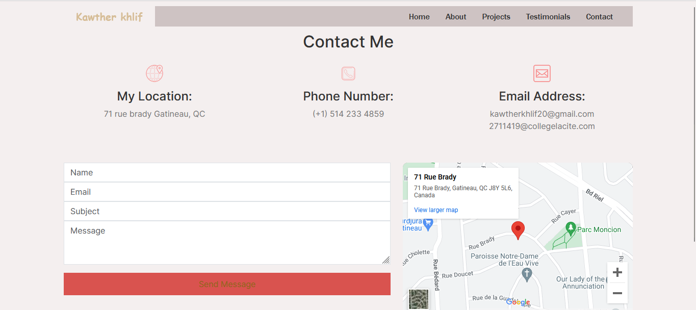

# Portfolio Next.js Project

## Introduction
Ce projet est la deuxième partie de mon projet de portfolio. L'objectif est de convertir un projet existant en React en utilisant Next.js. Ce portfolio inclut toutes les fonctionnalités et les pages de la première partie avec des améliorations pour valider les formulaires, ajouter des pages de témoignage, et protéger les pages à l'aide de Redux.

## Fonctionnalités

### Pages Principales
- **Home**: Page d'accueil du portfolio.
- **About**: Page présentant des informations personnelles.
- **Projects**: Page listant les projets réalisés.
- **Testimonials**: Page permettant aux utilisateurs de laisser et de voir des témoignages.
- **Contact**: Page pour contacter via un formulaire.

### Authentification
- **Login**: Page de connexion.
- **Signup**: Page d'inscription.

### Redux
- Utilisation de Redux pour gérer l'état global, en particulier pour l'authentification (login, inscription) et la gestion des témoignages.

## Installation et Configuration

1. **Clonez le dépôt**
    ```bash
    git clone https://github.com/kawther27/Portfolio-next.git
    ```

2. **Installez les dépendances**
    ```bash
    cd Portfolio-next
    npm install
    ```

3. **Démarrez le serveur de développement**
    ```bash
    npm run dev
    ```

4. **Accédez au projet dans le navigateur**
    Ouvrez [http://localhost:3001]

## Utilisation

### Pages de Témoignages
- **Voir les témoignages**: Accessible à tous les utilisateurs connectés.
- **Laisser un témoignage**: Accessible via la page des témoignages pour les utilisateurs connectés.
- **Modifier un témoignage**: Accessible pour les témoignages existants créés par l'utilisateur connecté.

### Authentification
- **Connexion et Inscription**: Les utilisateurs peuvent s'inscrire et se connecter pour accéder aux pages protégées.

## Structure du Projet
- **/app**: Contient les pages principales de l'application.
- **/components**: Contient les composants réutilisables.
- **/styles**: Contient les fichiers de styles CSS.
- **/public**: Contient les images et les ressources statiques.

## Copies d'écran

### Home Page


### About Page


### Projects Page


### Testimonials Page


### Contact Page


## Déploiement
Ce projet peut être déployé sur Vercel, la plateforme officielle pour les projets Next.js.
1. **Connexion à Vercel**
2. **Importez le projet depuis GitHub**
3. **Déployez le projet**

## Contributeurs
- **Kawther Khlif**: Développeur principal

## Licence
Ce projet est sous licence MIT. Voir le fichier [LICENSE](LICENSE) pour plus de détails.
